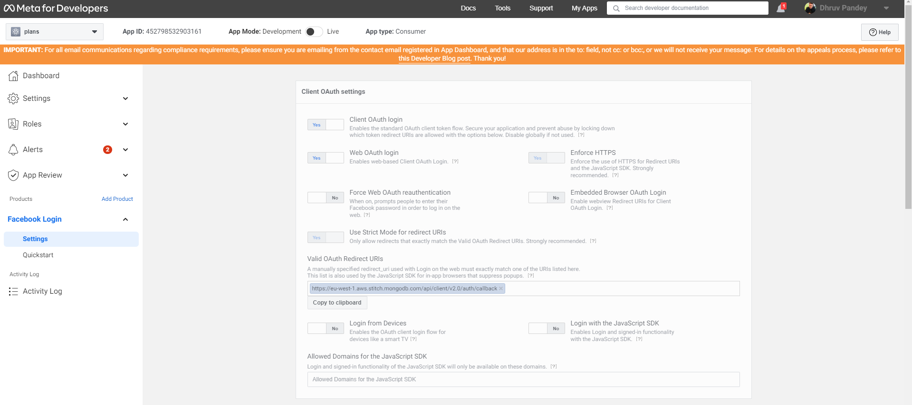

# Plans
## Free alternative to Meetup for personal usage

## Other Info

## Common errors
### 403 when deploying functions
xxxxxxx@gcf-admin-robot.iam.gserviceaccount.com does not have storage.objects.create access to the Google Cloud Storage bucket

**Fix**
1. Turn on the Cloud Build API from API and services.
2. Give storage.objects.create persmission to xxxxxxx@gcf-admin-robot.iam.gserviceaccount.com from IAM/Admin-->IAM.
Select Include Google-provided role grants from top right corner.

## Firebase Related 
### Check logs
firebase functions:log --only createPlan


### Google OAuth(One Tap Signin) with MongoDB Atlas
https://www.mongodb.com/docs/atlas/app-services/authentication/google/
```
import { CredentialResponse, GoogleLogin } from '@react-oauth/google';

<GoogleLogin onSuccess={onSuccess} onError={onFailure} useOneTap />

const onSuccess = (credentials: CredentialResponse) => {
    getAppUserGoogle(credentials).then((appUser) => {
      ...
    });
	
function getAppUserGoogle(googleCredentialsResponse: CredentialResponse) {
	const credentials = Realm.Credentials.google(googleCredentialsResponse.credential?.toString());
	const user = await getRealmApp().logIn(credentials);
    return user;
}
```

### Facebook OAuth with MongoDB Atlas
https://www.mongodb.com/docs/atlas/app-services/authentication/facebook/
```
import FacebookLogin, { ReactFacebookLoginInfo } from 'react-facebook-login';

<FacebookLogin appId='*****' autoLoad={false} fields='name,email,picture' callback={onSuccess} />

const onSuccess = (credentials: ReactFacebookLoginInfo) => {
    getAppUserFacebook(credentials).then((appUser) => {
      ...
    });
  };
	
function getAppUserFacebook(facebookCredentials: ReactFacebookLoginInfo) {
	const credentials = Realm.Credentials.facebook(facebookCredentials.accessToken.toString());
	const user = await getRealmApp().logIn(credentials);
	return user;
}
```

### App Secrets and Login URI

